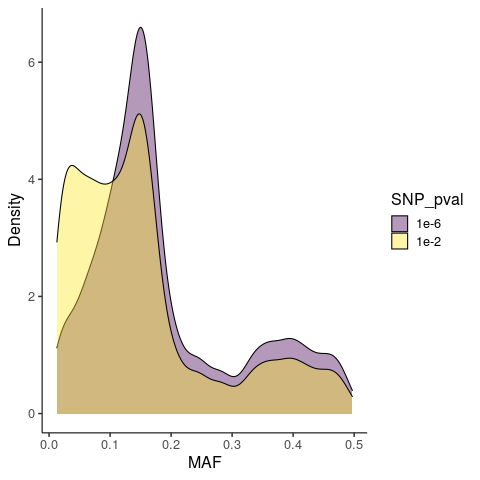

## 3. Allele frequencies and SNP calling

#### Allele Frequency Estimation

Now you will estimate allele frequencies using the GLs that you just calculated as input.

We can get some information about how to estimate allele frequencies with `angsd -doMaf`.

```
	-> angsd version: 0.931 (htslib: 1.9) build(Oct 25 2019 18:02:57)
	-> Analysis helpbox/synopsis information:
	-> Command: 
angsd -doMaf 	-> Sun Oct  9 21:08:30 2022
------------------------
abcFreq.cpp:
-doMaf	0 (Calculate persite frequencies '.mafs.gz')
	1: Frequency (fixed major and minor)
	2: Frequency (fixed major unknown minor)
	4: Frequency from genotype probabilities
	8: AlleleCounts based method (known major minor)
	NB. Filedumping is supressed if value is negative
-doPost	0	(Calculate posterior prob 3xgprob)
	1: Using frequency as prior
	2: Using uniform prior
	3: Using SFS as prior (still in development)
	4: Using reference panel as prior (still in development), requires a site file with chr pos major minor af ac an
Filters:
	-minMaf  	-1.000000	(Remove sites with MAF below)
	-SNP_pval	1.000000	(Remove sites with a pvalue larger)
	-rmTriallelic	0.000000	(Remove sites with a pvalue lower)
Extras:
	-ref	(null)	(Filename for fasta reference)
	-anc	(null)	(Filename for fasta ancestral)
	-eps	0.001000 [Only used for -doMaf &8]
	-beagleProb	0 (Dump beagle style postprobs)
	-indFname	(null) (file containing individual inbreedcoeficients)
	-underFlowProtect	0 (file containing individual inbreedcoeficients)
NB These frequency estimators requires major/minor -doMajorMinor
```

It's also useful to know how ANGSD identifies major and minor alleles, `angsd -doMajorMinor`

```
	-> angsd version: 0.931 (htslib: 1.9) build(Oct 25 2019 18:02:57)
	-> Analysis helpbox/synopsis information:
	-> Command: 
angsd -doMajorMinor 	-> Sun Oct  9 21:10:56 2022
-------------------
abcMajorMinor.cpp:
	-doMajorMinor	0
	1: Infer major and minor from GL
	2: Infer major and minor from allele counts
	3: use major and minor from a file (requires -sites file.txt)
	4: Use reference allele as major (requires -ref)
	5: Use ancestral allele as major (requires -anc)
	-rmTrans: remove transitions 0
	-skipTriallelic	0
```

Let's estimate minor allele frequences (MAFs) using the GLs that we calculated from the last section as input. When supplying a glf file as input we also
need to provide the number of individuals in the file with `-nInd` and the reference index file with `-fai`.

```bash
$angsd -glf10_text $RESDIR/PANY.glf.gz -out $RESDIR/PANY \
   -nInd 15 -fai $DIR/Ref_rename.fa.fai -doMajorMinor 1 -doMaf 1 -minInd 5
```

Note: You can always use bams as input but you need to recalculate the genotype likelihoods (with `-GL` as before), which is redundant unless
you want to change the filtering parameters, genotype likelihood model, etc. because the GLs are used in the allele frequency estimation.

<details>

<summary> Click to see how to calculate allele frequencies using the bams as input </summary>

```bash

$angsd -b $DIR/PANY_bams_rename.txt -ref $REF -out $RESDIR/PANY_wbams \
   -uniqueOnly 1 -remove_bads 1 -only_proper_pairs 1 -trim 0 -C 50 \
   -minMapQ 20 -minQ 20 -minInd 5 -setMinDepthInd 1 -setMinDepth 7 -setMaxDepth 30 -doCounts 1 \
   -GL 1 -doMajorMinor 1 -doMaf 1

```

</details>

In general, `-GL 1`, `-doMaf 1/2`, and `-doMajorMinor 1` should be the preferred choice when data uncertainty is high.

Take a look at the MAF file with `less $RESDIR/PANY.mafs.gz`. The first 20 lines of the file should look like

```
chromo	position	major	minor	knownEM	nInd
chr24	27	A	C	0.000004	5
chr24	28	T	A	0.000004	5
chr24	29	T	A	0.000004	5
chr24	30	T	A	0.000004	5
chr24	31	A	C	0.000004	5
chr24	32	T	A	0.000004	5
chr24	35	C	A	0.000004	5
chr24	38	A	C	0.000004	5
chr24	39	T	A	0.000004	6
chr24	40	G	A	0.000005	7
chr24	41	T	A	0.000006	7
chr24	42	G	A	0.000005	7
chr24	43	T	A	0.000006	7
chr24	44	T	A	0.000006	7
chr24	45	G	A	0.000005	7
chr24	46	A	C	0.000006	7
chr24	47	T	A	0.000006	7
chr24	48	C	G	0.430705	7
chr24	49	T	A	0.000004	6
```

The columns are (1) chromosome/ref sequence name, (2) position, (3) the major allele, (4) the minor allele, (5) the allele frequency, 
(6) the number of indivdiuals with data used in the calculation of allele frequency. The number of individuals in the last 
column should never be below 5 since you specified `-minInd 5`.

You'll notice that many sites have very low frequency suggesting that they are likely monomorphic. You can probably start guessing 
how you can use these frequencies to call SNPs, so we'll do that next.

<details>
<summary> Click here for a bonus note on using MAF files for calculating Dxy  </summary>
</details>

## SNP calling

You can statistically test for whether a site is variable in ANGSD using a likelihood ratio (LR) test, which compares the likelihood that the 
minor allele frequency (MAF) is zero (the null) to the likelihood of the estimated MAF (with `-doMaf`). Under the null, -2log(LR statistic) 
is chi-square distributed with one degree of freedom, and so we can calculate a p-value for whether the estimated MAF is statistically 
different from zero, in which case the site is a SNP.

Let's call biallelic PANY SNPs at four different significance levels:

```bash
for PV in 0.05 0.01 1e-4 1e-6
do
   if [ $PV == 0.05 ]; then echo SNP_pval Number_SNPs; fi
   $angsd -b $DIR/PANY_bams_rename.txt -ref $REF -out $RESDIR/PANY_$PV \
      -uniqueOnly 1 -remove_bads 1 -only_proper_pairs 1 -trim 0 -C 50 \
      -minMapQ 20 -minQ 20 -minInd 5 -setMinDepthInd 1 -setMinDepth 7 -setMaxDepth 30 -doCounts 1 \
      -GL 1 -doMajorMinor 1 -doMaf 1 -rmTriallelic 0.05 -SNP_pval $PV &> /dev/null
   echo $PV `zcat $RESDIR/PANY_$PV.mafs.gz | tail -n+2 | wc -l`
done
```

Sites that may have more than two alleles are purged using `-rmTriallelic` in our example above.

Have a look at the outputs, e.g. `less $RESDIR/PANY_0.05.mafs.gz`. You'll notice two additional columns in the MAF file. 
There is now a field, 'ref', with the reference allele, and a "pK-EM" field, which shows the p-value for the likelihood 
ratio test of whether the site is variable.

**QUESTION**

What is the relationship between the value of `SNP_pval` and the number of identified SNPs?

<details>

<summary> Click for help </summary>

```
SNP_pval Number_SNPs
0.05 22873
0.01 16466
1e-4 9084
1e-6 6263
```

Here's a representative image of what happens to the distribution of allele frequencies as you become more stringent in calling SNPs.
Note that sites with MAF below a certain cutoff can be discarded with `-minMaf`. This can be useful for PCA, admixture, or GWAS-type analyses where a 
minimum MAF (e.g. 5%) can help reduce noise and improve inference.





</details>

It's generally advisable to call SNPs among all individuals jointly to avoid biasing downstream inferences. Let's do that:

```bash

$angsd -b $DIR/ALL_bams_rename.txt -ref $REF -out $RESDIR/ALL \
   -uniqueOnly 1 -remove_bads 1 -only_proper_pairs 1 -trim 0 -C 50 \
   -minMapQ 20 -minQ 20 -minInd 20 -setMinDepthInd 1 -setMinDepth 28 -setMaxDepth 120 -doCounts 1 \
   -GL 1 -doMajorMinor 1 -doMaf 1 -rmTriallelic 0.05 -SNP_pval 1e-6

```

When estimating allele frequencies it is important to point out that with `-doMajorMinor 1` we are estimating the **minor allele** frequency 
for the group being analyzed. The minor allele could be different between populations. For example, the minor allele in the PANY population 
could be the major allele in JIGA, and vice versa. When comparing allele frequencies between groups or populations we typically want to focus on the same
allele. We can do this with `-doMajorMinor 3, 4, or 5`.

**QUESTION**

How could you compare the **derived** allele frequencies at sites segregating among the PANY and JIGA populations? Try doing this.

Hint: You can have ANGSD analyze a subset of sites using the `-sites` argument. You can read about it [here](http://www.popgen.dk/angsd/index.php/Sites)

<details>

<summary> Click for help </summary>

You would need to use `-doMajorMinor 5` and pass the ancestral reference with `-anc` when calling `-doMaf`. If this is done for sites that are biallelic 
then the frequency for the same derived allele (i.e. non-ancestral allele) at each site can be compared between populations.

Since we know which sites are segregating among all individuals we can restrict the output of ANGSD to this subset of sites by passing a `sites` file. 
So let's first extract this set of variable sites from the MAFs file.

```bash
# extract positions from the mafs file

zcat $RESDIR/ALL.mafs.gz | cut -f1,2 | tail -n+2 > $RESDIR/biallelic_snps.pos

# index the sites file

$angsd sites index $RESDIR/biallelic_snps.pos

```

Now you can calculate allele frequencies that would be comparable between populations.

```bash
# Calculate derived allele frequencies for PANY

$angsd -b $DIR/PANY_bams_rename.txt -ref $REF -out $RESDIR/PANY_derived \
   -uniqueOnly 1 -remove_bads 1 -only_proper_pairs 1 -trim 0 -C 50 -minMapQ 20 -minQ 20 \
   -GL 1 -doMajorMinor 5 -anc $ANC -doMaf 1 -sites $RESDIR/biallelic_snps.pos

'''

'''bash
# Calculate derived allele frequencies for JIGA

$angsd -b $DIR/JIGA_bams_rename.txt -ref $REF -out $RESDIR/JIGA_derived \
   -uniqueOnly 1 -remove_bads 1 -only_proper_pairs 1 -trim 0 -C 50 -minMapQ 20 -minQ 20 \
   -GL 1 -doMajorMinor 5 -anc $ANC -doMaf 1 -sites $RESDIR/biallelic_snps.pos

```

Are you able to describe what the commands above are doing?

</details>

Now you know how to estimate allele frequencies and call SNPs based on these frequencies. Next you'll learn how to call genotypes.


[click here](https://github.com/nt246/physalia-lcwgs/blob/main/day_2/markdowns/04_genotype.md) to move to the next session.

---------------------------------------
