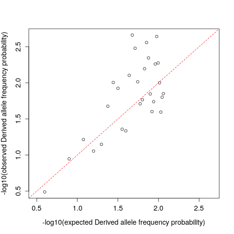

Site Frequency Spectrum & Summary Statistics
============================================

<br>

The following exercises will teach you how to estimate the site frequency spectrum (SFS) and some population 
genetic summary statistics that are based on the SFS from low coverage whole-genome sequencing data using ANGSD.

### Initial Preparation

For today's exercises please generate the following directories

```bash
mkdir ~/day4
mkdir ~/day4/Results
mkdir ~/day4/Data

cd ~/day4

```

and set the following environment variables


```bash
DIR=/home/ubuntu/Share/physalia-lcwgs/data
REF=$DIR/Ref.fa
ANC=$DIR/outgrp_ref.fa
RESDIR=~/day4/Results
DATDIR=~/day4/Data
ANGSD=/home/ubuntu/angsd/angsd
REALSFS=/home/ubuntu/angsd/misc/realSFS
THETASTAT=/home/ubuntu/angsd/misc/thetaStat
SCRIPTS=/home/ubuntu/Share/physalia-lcwgs/day_4

```

### Data

We will continue to work with the low-coverage NGS data for 60 Atlantic silversides from the following four populations:


These populations have been previously studied in [Therkildsen et al. 2019](https://science.sciencemag.org/content/365/6452/487) and [Wilder et al. 2020](https://onlinelibrary.wiley.com/doi/10.1002/evl3.189), and cover the entire range of the species.

Our NGS data are in BAM format and span a 2Mb region on chromosome 24. The interesting aspect about chromosome 24 is that it harbours a large polymorphic inversion that differs in its frequency across populations. 
The test dataset spans one breakpoint of this inversion (1Mb up and downstream).


### The Site Frequency Spectrum (SFS)

The SFS characterizes the distribution of sample allele frequencies. Specifically, the SFS records the number (or proportion) of sites in different allele 
frequency categories. This summary of allele frequencies has many uses including assessing data quality, inferring demography, and detecting selection.
The "unfolded" SFS characterizes the frequency of derived alleles and requires some way to "polarize" alleles, i.e. decide which allelic state is 
ancestral and which is derived. It's common to use an outgroup sequence for this. The SFS can also be folded, in which case it characterizes the 
distribution of minor allele frequencies in a population. The folded SFS consists of allele frequency classes of 1/2*n* to 0.5 (where *n* is the diploid sample size). 
To fold the spectrum, sites with derived allele frequencies of (2*n*-1)/2*n* are in the same class as 1/2*n* sites, (2*n*-2)/2*n* sites are in the same class as 2/2*n* 
sites, (2*n*-3)/2*n* sites are in the same class as 3/2*n* sites, up to a class of 0.5 allele frequency (the highest frequency a minor allele can 
take by definition).

We will use ANGSD to estimate the SFS using the methods described [here](http://www.ncbi.nlm.nih.gov/pubmed/22911679).
Details on the implementation can be found [here](http://popgen.dk/angsd/index.php/RealSFSmethod). The main page describing the SFS and multidimensional 
SFS is [here](http://popgen.dk/angsd/index.php/SFS_Estimation).

The general workflow is


We will estimate the unfolded SFS for the PANY population. To do this first we need to estimate the likelihood of sampling *k*=0, *k*=1, *k*=2, ...,*k*=2*n* derived alleles at 
every site. Note *k* represents the number of derived alleles at a site. This is accomplished using `-doSaf`. We will start with BAMs as input and as usual we will use `-GL` 
to calculate genotype likelihoods.

`-doSaf`

```bash
...
	-doSaf		0
	   1: SAF calculation integrating over possible minor alleles
	   2: SAF calculation incorporating inbreeding
	   3: Calculate genotype probabilities using SAF (DEPRECATED; use -doPost 3)
	   4: SAF calculation from genotype posteriors (input is beagle text format)
	   5: SAF calculation conditioning on minor allele from -doMajorMinor
	 -underFlowProtect	0
	 -anc		(null)	(ancestral fasta)
	 -noTrans	0	(remove transitions)
	 -pest		(null)	(prior SFS)
	 -isHap		0	(samples are haploid; works with -doSaf 1 or 5)
	 -scoreTol	1.0e-09	(tolerance for score-limited algorithm)
	 -doPost	0	(doPost 3, used for accessing SAF based variables)

NB: If -pest is supplied in addition to -doSaf then the output will be posterior probabilities of the sample allele frequency for each site
NB: Increasing -scoreTol will trade accuracy for reduced computation time and storage
```

Let's calculate the allele frequency likelihoods at all sites. You will typically use `-doSaf 1` unless your population is highly inbred 
in which case `-doSaf 2` is more accurate.

```bash
$ANGSD -b $DIR/PANY_bams.txt -ref $REF -anc $ANC -out $RESDIR/PANY \
   -uniqueOnly 1 -remove_bads 1 -only_proper_pairs 1 -trim 0 -C 50 \
   -minMapQ 20 -minQ 20 -minInd 5 -setMinDepthInd 1 -setMinDepth 7 -setMaxDepth 60 -doCounts 1 \
   -GL 1 -doSaf 1

```

You can have a look at the results using `realSFS` (note that realSFS is querying the index to make a human-readable 
output that combines the .saf.gz and .saf.pos.gz files):

```bash
$REALSFS print $RESDIR/PANY.saf.idx | less -S
```

The columns are (1) chromosome, (2) position, (3) likelihood of 0 derived alleles, (4) likelihood of 1 derived allele, 
(5), likelihood of 2 derived alleles, ..., (2N+2) likelihood of having 2N derived alleles. Note that the likelihoods 
are scaled to the highest likelihood and log transformed (such that the most likely allele frequency will have a 
value of 0).

**QUESTION**

Can you identify the first two variable sites? Note that I'll refer to Mme_chr24:2558528-4558528 simply as chr24 for readability at times throughout this tutorial.

<details>

<summary> Click for answer </summary>

chr24:48
<br/>
chr24:61

</details>

**QUESTION**

What is the most likely number of derived alleles at position chr24:61?

<details>

<summary> Click for answer </summary>

3 derived alleles.

</details>

Help information for the `realSFS` program can be seen by calling `realSFS` without arguments.

```bash
Usage:
	realSFS [options] deme1.saf.idx [deme2.saf.idx ...]	(calculates [multi-]SFS)
	realSFS subcommand					(displays usage for subcommands)
Options:
	-r chrom[:start-end]	(use only sites in specified region)
	-sites ?		(use only these sites, see 'Notes')
	-anc ?			(??, see 'Notes')
	-ref ?			(??, see 'Notes')
	-cores 1		(number of threads)
	-tole 1e-10		(convergence tolerance for EM)
	-maxiter 100		(maximum number of EM iterations)
	-bootstrap 0		(number of bootstrap replicates)
	-resample_chr 0		(0 = bootstrap sites; 1 = bootstrap chromosomes/contigs)
	-emaccl 1		(0 = regular EM; 1 = accelerated EM)
	-fold 0			(0 = unfolded SFS; 1 = folded SFS)
	-nsites 0		(number of sites to use in calculation; 0 = all sites)
	-seed -1		(random seed for start values; -1 = machine noise)
Subcommands:
	bins			(print SFS bins corresponding to flattened output)
	cat			(concatenate two SAF files)
	check			(checks that positions are ordered correctly)
	dadi			(call SFS bin for each site via empirical Bayes)
	fst			(index and calculate per-site Fst)
	print			(print SAF in various formats)
	print_header		(print SAF index information)
	saf2theta		(create inputs for theta calculation in bands)
	text2saf		(convert text saffile to binary safv3 file)
	winsfs			(Window SFS might be more stabile)
Examples:
	#one-dimensional SFS
	./realSFS deme.saf.idx

	#one-dimensional SFS for all of chromosome 22
	./realSFS deme.saf.idx -r chr22

	#two-dimensional SFS for all of chromosome 22
	./realSFS deme1.saf.idx deme2.saf.idx -r chr22

	#estimate the SFS for the first 500Mb (including multiple chromosomes)
	./realSFS deme.saf.idx -nsites 500000000

	#estimate the SFS for a specified region (e.g. around a gene)
	./realSFS deme.saf.idx -r chr2:135000000-140000000

	#generate 100 bootstrap replicates of SFS by resampling contigs
	./realSFS deme.saf.idx -bootstrap 100 -resample_chr 1
Notes:
	Output is the maximum likelihood estimate of sites for each SFS bin, as a flattened array. If multiple index files are supplied, the joint SFS is calculated. To see the SFS bins associated with each value in the array, use the 'bins' subcommand (especially useful for folded multidimensional SFS). Bootstrap replicates are output one/line after the MLE.
```

Now we will use the allele frequency likelihoods calculated for every site contained in the .saf file to obtain 
a maximum likelihood estimate of the SFS with the `realSFS` program.

```bash
$REALSFS $RESDIR/PANY.saf.idx > $RESDIR/PANY.sfs
```

Take a look at the output:

```bash
cat $RESDIR/PANY.sfs
```
You should observe the following vector of 2N+1 values (you'll need to scroll right in the markdown box to see them all):

```bash
1287585.159170 5441.014450 1893.638927 1024.182258 1477.927761 1192.652825 353.801352 166.179066 199.498879 736.762268 775.654171 132.182867 36.552615 55.659970 162.170177 327.757461 287.965161 106.914226 46.408186 75.780528 238.957573 419.965002 305.941344 92.168706 38.235800 89.032890 167.489915 426.555830 265.498645 236.967396 47411.324580
```


These are the *expected* number of sites in the PANY sample with 0 (value 1), 1 (value 2), 3 (value 3), ..., 2N (value 2N+1) derived alleles.

Let's plot the SFS as a barplot:

```bash
$SCRIPTS/plotSFS.R $RESDIR/PANY.sfs $RESDIR/PANY_SFS 0

# note that the plotSFS.R script is found in the github repo at https://github.com/nt246/physalia-lcwgs/tree/main/day_4

```

<details>

<summary> click for plotSFS.R code </summary>

```bash
#!/usr/bin/env Rscript

# plotSFS.R <SFS file> <output prefix> <fold>
# if fold = 0 the input SFS is unfolded, otherwise if fold = 1 the input SFS is assumed to be folded


# parse inputs
fold <- 1
args <- commandArgs(trailingOnly=TRUE)

sfs <- scan(args[1])
outprefix <- args[2]
fold <- as.numeric(args[3])
n <- (length(sfs)-1)/2
xlabel <- NULL
idx <- NULL
name.n <- NULL

if (fold == 1) {
   xlabel = "MAF"
   idx = n+1
   name.n = n
   if (sum(sfs[(n+2):(length(sfs))]) > 0) cat("WARNING: Assuming folded SFS input despite that it looks unfolded...\n")
} else {
   idx = 2*n
   xlabel = "Derived allele frequency"
   name.n = idx-1
}

# plot
pdf(file=paste0(outprefix,".pdf"),width=14,height=7)
barplot(sfs[2:idx], xlab=xlabel, ylab="Number SNPs", names=1:name.n, cex.names=0.8, cex.axis=1.2, cex.lab=1.2) # plot SFS without fixed categories
invisible(dev.off())
```

</details>

This will dump a PANY_SFS.pdf file containing the plot that you can scp onto your local machine to look at or view with e.g. `evince` remotely. 
The SFS barplot is shown below for convenience.


We can also compare our observed SFS to what we would expect for a neutrally evolving, constant-size population.

```bash
# barplot
$SCRIPTS/compare_sfs.R $RESDIR/PANY.sfs $RESDIR/PANY_SFS_compare 0 bar

# scatterplot
$SCRIPTS/compare_sfs.R $RESDIR/PANY.sfs $RESDIR/PANY_SFS_compare 0 scatter

# note that the compare_sfs.R script is found in the github repo at https://github.com/nt246/physalia-lcwgs/tree/main/day_4

```

<details>

<summary> Click for compare_sfs.R code </summary>

```bash
#!/usr/bin/env Rscript

# compare_sfs.R <SFS file> <output prefix> <use folded (0|1)> <plot type: "bar"|"scatter">

# parse inputs
args <- commandArgs(trailingOnly=TRUE)

obs <- scan(args[1])
outprefix <- args[2]
fold <- as.numeric(args[3]) # is the SFS folded (1 = yes, 0 = no)
plottype <- args[4]

obs <- obs[-1] # remove fixed zero category
nchr = length(obs) # number chromosomes
n = nchr/2
xlabel = NULL
if (fold) {
	obs <- obs[1:n]
	xlabel = "MAF"
} else {
	obs <- obs[-length(obs)] # format observed SFS
	xlabel = "Derived allele frequency"
}
s =  sum(obs) # number segregating sites
nlab = ifelse(fold,n,nchr-1)

# calculate expected unfolded SFS counts
a = sum(1/1:(nchr-1))
sfs.expected <- sapply(1:(nchr-1),function(x,segsites,a){segsites/(x*a)}, segsites=s, a=a)

# fold SFS if necessary
if (fold) {
	sfs.fold = sapply(1:(n-1),function(x,sfs,nchr){sfs[x]+sfs[nchr-x]},nchr=nchr,sfs=sfs.expected)
	sfs.fold = c(sfs.fold,sfs.expected[n])
	sfs.expected = sfs.fold
}

if (plottype == "bar") {
# plot observed vs expected as a barplot
	pdf(file=paste0(outprefix,"_barplot.pdf"),width=14,height=7)
	sfs.mat <- t(as.matrix(data.frame(obs=obs, expected=sfs.expected)))
	barplot(sfs.mat, beside=TRUE, names=c(1:nlab), cex.names=0.7, col=rep(c("grey80","grey10"),nlab),xlab=xlabel,ylab="Number SNPs", cex.lab=1.2, cex.axis=1.2)
	legend('topright',c("observed","expected"),fill=c("grey80","grey10"),bty='n',cex=1.2)
	invisible(dev.off())
} else if (plottype == "scatter") {
	# plot expected vs observed scatterplot
	pdf(file=paste0(outprefix,"_scatter.pdf"))
	sfs.obs.p <- obs/sum(obs)
	sfs.e.p <- sfs.expected/sum(sfs.expected)
	px = -log10(sfs.e.p)
        py = -log10(sfs.obs.p)
        plot(y=py, x=px, ylab=paste0("-log10(observed ", xlabel, " probability)"), xlab=paste0("-log10(expected ", xlabel, " probability)"), 
        xlim=c(min(c(px,py)),max(c(px,py))),cex.lab=1.2, cex.axis=1.2)
	abline(0,1,col="red",lty=2)
	invisible(dev.off())
} else stop("Unrecognized plot type")
```

</details>

This will dump pdf files containing the images as before, which are also shown below.





What if we did not have an outgroup to polarize alleles with? In this case we could calculate the folded SFS. Let's try it.

First we'll calculate the allele frequency likelihoods with `-doSaf 1`, which requires us to supply `-anc` for which we will supply 
the reference FASTA in the case of folding (remember, we are pretending that we don't have a reliable ancestral fasta to polarize with):


```bash
$ANGSD -b $DIR/PANY_bams.txt -ref $REF -anc $REF -out $RESDIR/PANY_fold \
   -uniqueOnly 1 -remove_bads 1 -only_proper_pairs 1 -trim 0 -C 50 \
   -minMapQ 20 -minQ 20 -minInd 5 -setMinDepthInd 1 -setMinDepth 7 -setMaxDepth 60 -doCounts 1 \
   -GL 1 -doSaf 1

```

Now calculate the SFS using this new .saf file as before, except this time tell `realSFS` to fold the spectrum with `-fold 1`

```bash
$REALSFS -fold 1 $RESDIR/PANY_fold.saf.idx > $RESDIR/PANY_fold.sfs
```

Let's look at the ML estimate of the folded SFS:

```bash
cat $RESDIR/PANY_fold.sfs
```

Now your vector of expected counts should look like this (scroll to see all values):
```bash
1403715.239733 6987.037568 2279.638485 2180.218338 1813.594151 1117.329380 697.428766 652.617721 797.370326 889.151374 744.767130 541.466942 478.770881 458.365587 405.231595 187.772023 0.000000 0.000000 0.000000 0.000000 0.000000 0.000000 0.000000 0.000000 0.000000 0.000000 0.000000 0.000000 0.000000 0.000000 0.000000
```

The folded SFS is represented by the first 1 through N values. These are the expected number of sites with minor allele counts of 0, 1, 2, ..., N. `realSFS` still prints 2N+1 values but 
the N+1 to 2N+1 values should all be `0.000000` and can be ignored when using `-fold 1` because these categories don't really exist in the folded SFS.

### Allele frequency posterior probabilities

Since you were able to calculate allele frequency likelihoods with `-doSaf` you may be wondering if you can use these to calculate the posterior probabilities of the possible 
allele frequencies at each site. You can! In order to do this you can use the site frequency spectrum calculated with `realSFS` as a prior on the allele frequencies since it tells 
you the probability of randomly drawing a site with a given number of derived (or minor if folded) alleles in the population.

Let's calculate derived allele frequency posterior probabilities for the PANY population. This is achieved by running the per site allele frequency likelihood calculation (`-doSaf`) while supplying 
the SFS are a prior with '-pest':

```bash
$ANGSD -b $DIR/PANY_bams.txt -ref $REF -anc $ANC -out $RESDIR/PANY_post \
   -uniqueOnly 1 -remove_bads 1 -only_proper_pairs 1 -trim 0 -C 50 \
   -minMapQ 20 -minQ 20 -minInd 5 -setMinDepthInd 1 -setMinDepth 7 -setMaxDepth 60 -doCounts 1 \
   -GL 1 -doSaf 1 -pest $RESDIR/PANY.sfs

```

Have a look at the output:

```bash
$REALSFS print $RESDIR/PANY_post.saf.idx 2>/dev/null | less -S
```
The columns are (1) chromosome, (2) position, and then the posterior probability of having 0, 1, 2, 3, ..., 2N derived alleles in each of the subsequent columns. The posterior 
probablities are log transformed.

**QUESTION**

What is the most probable number of derived alleles at chr24:61?

<details>

<summary> Click for answer </summary>

0 derived alleles.

</details>

**QUESTION**

What is the posterior probability that position chr24:61 has 1 derived allele (i.e. is a singleton)?

<details>

<summary> Click for answer </summary>

The second value in the probabillity vector for chr24:61 is the probability of 1 derived allele in log space. 
This value is -1.844222. So the probability that this site is a singleton is exp(-1.844222) = **0.1581483**.

</details>

**QUESTION**

What is the probability that the following sites are variable?

24:39
</br>
24:48
</br>
24:61

<details>

<summary> Click for answer </summary>

The probability that a site is variable is given by, P(variable) = 1 - P(0 derived alleles) + P(2N derived alleles). This is because sites with either 0 or 2N derived 
alleles are fixed.


P(chr24:39 is variable) = 1 - (exp(-0.005389) + exp(-Inf)) = 0.005374505
</br>
P(chr24:48 is variable) = 1 - (exp(-Inf) + exp(-Inf)) = 1
</br>
P(chr24:61 is variable) = 1 - (exp(-0.638232) + exp(-Inf)) = 0.4717745

Alternatively, you could take the sum over P(*x* derived alleles) for *x*=1 to *x*=2N-1. This would give the same answers.

</details>

**BONUS QUESTION**

What would the SFS calculated for a single diploid individual tell you?

<details>

<summary> Click for answer </summary>

The possible allele frequency categories for a single diploid individual are 0, 1, and 2 derived alleles for the unfolded SFS  
or just 0 and 1 minor alleles for the folded SFS. A site with one derived (or minor) allele in a single individual represents a heterozygous site, 
so the SFS for a single individual provides the heterozygosity of that individual. This is how you calculate heterozygosity in ANGSD.

</details>

### Diversity and Neutrality Statistics

Various population genetic summary statistics, including commonly used measures of genetic diversity, can be calculated directly from the SFS. 
Here we'll learn how to estimate some of these different measures of genetic diversity using the PANY population as an example. 
The methods are described [here](https://bmcbioinformatics.biomedcentral.com/articles/10.1186/1471-2105-14-289).
Since these statistics are estimated from the SFS we supply `realSFS` with the allele frequency likelihoods at all sites (.saf.idx file) as well as the 
ML estimate of the SFS (.sfs file). The program can then calculate posterior probabilities for different allele frequencies accross all sites 
and, ultimately, the posterior expectated SFS. This SFS is then used to calculate diversity statistics. Here we are not using the folded SFS 
but if you were, you would supply the `-fold 1` argument at this stage. 

```bash
$REALSFS saf2theta $RESDIR/PANY.saf.idx -outname $RESDIR/PANY -sfs $RESDIR/PANY.sfs
```

You can view log-transformed per site estimates of theta using `thetaStat`. Try viewing the first 20 sites.

```bash
$THETASTAT print $RESDIR/PANY.thetas.idx 2>/dev/null | head -n 21
```

```bash
#Chromo	Pos	Watterson	Pairwise	thetaSingleton	thetaH	thetaL
Mme_chr24:2558528-4558528	27	-6.557440	-7.278302	-5.695343	-9.283698	-7.845163
Mme_chr24:2558528-4558528	28	-6.557440	-7.278302	-5.695343	-9.283698	-7.845163
Mme_chr24:2558528-4558528	29	-6.557440	-7.278302	-5.695343	-9.283698	-7.845163
Mme_chr24:2558528-4558528	30	-6.557440	-7.278302	-5.695343	-9.283698	-7.845163
Mme_chr24:2558528-4558528	31	-6.557440	-7.278302	-5.695343	-9.283698	-7.845163
Mme_chr24:2558528-4558528	32	-6.557443	-7.278310	-5.695343	-9.283727	-7.845174
Mme_chr24:2558528-4558528	35	-6.557443	-7.278310	-5.695343	-9.283727	-7.845174
Mme_chr24:2558528-4558528	38	-6.557443	-7.278310	-5.695343	-9.283727	-7.845174
Mme_chr24:2558528-4558528	39	-6.602772	-7.355801	-5.716146	-9.435252	-7.931166
Mme_chr24:2558528-4558528	40	-6.688331	-7.495578	-5.759189	-9.691832	-8.083268
Mme_chr24:2558528-4558528	41	-6.729235	-7.559628	-5.781463	-9.803245	-8.151958
Mme_chr24:2558528-4558528	42	-6.688332	-7.495582	-5.759189	-9.691842	-8.083272
Mme_chr24:2558528-4558528	43	-6.729242	-7.559647	-5.781463	-9.803303	-8.151980
Mme_chr24:2558528-4558528	44	-6.729246	-7.559657	-5.781463	-9.803333	-8.151993
Mme_chr24:2558528-4558528	45	-6.688335	-7.495590	-5.759189	-9.691867	-8.083282
Mme_chr24:2558528-4558528	46	-6.729248	-7.559663	-5.781463	-9.803354	-8.152000
Mme_chr24:2558528-4558528	47	-6.729248	-7.559663	-5.781463	-9.803354	-8.152000
Mme_chr24:2558528-4558528	48	-1.376662	-0.822030	-15.112546	-1.061792	-0.934742
Mme_chr24:2558528-4558528	49	-6.602776	-7.355811	-5.716146	-9.435287	-7.931179
Mme_chr24:2558528-4558528	50	-6.688341	-7.495606	-5.759189	-9.691919	-8.083302
```
The columns are (1) Chromosome, (2) position, (3) Watterson's theta, (4) nucleotide diversity, (5) theta based only on singletons, (6) theta H, (7) theta L.
The estimates of theta are linear functions of the SFS, so if you wanted to estimate theta for a region you simply sum the estimates over all sites in the region.

There is an easy way in ANGSD however to calculate genome-wide estimates of theta for each chromosome along with some statistics commonly used to 
detect signatures of selection once you have the .thetas.idx file, which we'll do now.

```bash
$THETASTAT do_stat $RESDIR/PANY.thetas.idx
```
Have a look at the output:

```bash
less -S $RESDIR/PANY.thetas.idx.pestPG
```
There are 14 tab-delimited fields. The first 3 columns provide information about the coordinates of the genomic region (window) that the statistic values are for. In this instance 
these coordinates specify the entire chromosome (Mme_chr24:2558528-4558528) since we did not give any window information to `thetaStat`. The next five columns 
give different estimates of theta, followed by five columns with different neutrality statistics calculated from the theta estimates. The last column is the number of sites with data that were 
used in calculating the statistics for the given region. More information about the output can be found [here](http://www.popgen.dk/angsd/index.php/Thetas,Tajima,Neutrality_tests).

**QUESTION**

What are the per site estimates of Watterson's theta and nucleotide diversity for Mme_chr24:2558528-4558528? What is the estimate of 
Tajima's D for this region?

<details>

<summary> Click for help </summary>

The output is:

```bash
#(indexStart,indexStop)(firstPos_withData,lastPos_withData)(WinStart,WinStop)	Chr	WinCenter	tW	tP	tF	tH	tL	Tajima	fuf	fud	fayh	zeng	nSites
(0,1351769)(27,1999989)(0,1999989)	Mme_chr24:2558528-4558528	999994	4233.873378	3712.268273	5440.874692	4406.047859	4059.158069	-0.483002	-0.758499	-0.698366	-0.142861	-0.037702	1351769
```

The total number of sites used in the statistic calculations are given in the last column, and is equal to 1351769.

The per site estimate for Watterson's theta (column "tW") is 4233.873378 / 1351769 = 0.003132098.

The per site estimate of nucleotide diversity (column "tP") is 3712.268273 / 1351769 = 0.00274623.

Tajima's D is given in column 9 ("Tajima") and is equal to -0.483002.

</details>

It is also possible to have `thetaStat` print thetas and neutrality statistics in windows along the genome. As an example, let's look at windows of 10kb along Mme_chr24:2558528-4558528 
using a step size of 1kb (i.e. every 10kb window will be advanced by 1kb).

```bash
$THETASTAT do_stat $RESDIR/PANY.thetas.idx -win 10000 -step 1000  -outnames $RESDIR/PANY.thetasWindow.gz  
```

Let's look at the window output:

```bash
less -S $RESDIR/PANY.thetasWindow.gz.pestPG | less -S
```

### Multidimensional SFS and F<sub>ST</sub>

In this part of the tutorial you will learn how to estimate the joint site frequency spectrum. In this case we're 
calculating the joint SFS between two populations, which is generally called the 2D-SFS. Note that ANGSD can estimate 
the joint SFS for more than two populations, which is useful for inferring branch-specific divergence with Population Branch Length statistics (PBS), which we won't 
be covering here. More information about calculating multidimensional frequency spectra with ANGSD can be found [here](http://www.popgen.dk/angsd/index.php/2d_SFS_Estimation). 
Information about calculating F<sub>ST</sub> and and PBS can be found [here](http://www.popgen.dk/angsd/index.php/Fst)

We'll calculate the 2D-SFS between the PANY and MAQU populations. The first step is to estimate allele frequency likelihoods across all sites for each population 
separately. We've already done this for the PANY population, so let's do this calculation for the MAQU population:

```bash
$ANGSD -b $DIR/MAQU_bams.txt -ref $REF -anc $ANC -out $RESDIR/MAQU \
   -uniqueOnly 1 -remove_bads 1 -only_proper_pairs 1 -trim 0 -C 50 \
   -minMapQ 20 -minQ 20 -minInd 5 -setMinDepthInd 1 -setMinDepth 7 -setMaxDepth 60 -doCounts 1 \
   -GL 1 -doSaf 1

```

Then we can use each population's respective allele frequency likelihoods to obtain a maximum likelihood estimate of the 
joint allele frequency likelihoods:

```bash
$REALSFS $RESDIR/PANY.saf.idx $RESDIR/MAQU.saf.idx > $RESDIR/PANY_vs_MAQU.2dsfs
```
Let's have a look at the output:

```bash
less -S $RESDIR/PANY_vs_MAQU.2dsfs
```

Now we have a prior for the joint probability of observing *i* alleles in PANY and *j* alleles in MAQU. One way common way to visualize the 2D-SFS is with a 
with a heatmap. We're going to use these probabilities of jointly observing combinations of allele frequencies in our two example populations to calculate 
F<sub>ST</sub> between them. F<sub>ST</sub> is a commonly used measure of genetic differentiation based on allele frequencies that spans from 0 when the allele frequencies are the same 
in both populations to 1 when the populations are fixed for different alleles. F<sub>ST</sub> can be expressed in terms of the genetic variance within subpopulations 
(denoted here as *b<sub>s</sub>*) and between subpopulations (denoted here as *a<sub>s</sub>*) and between subpopulations: F<sub>ST</sub> = a<sub>s</sub> / (a<sub>s</sub> + b<sub>s</sub>).

UPDATE: `realSFS fst print` now prints the between population genetic variance (a<sub>s</sub>) in column 3 and the total population variance (c<sub>s</sub> = a<sub>s</sub> + b<sub>s</sub>) 
in column 4 such that F<sub>ST</sub> = a<sub>s</sub> / c<sub>s</sub>, i.e. column 3 value divided by column 4 value.

We can calculate these genetic variances with `realSFS` for our two example populations like so:

```bash
$REALSFS fst index $RESDIR/PANY.saf.idx $RESDIR/MAQU.saf.idx -sfs $RESDIR/PANY_vs_MAQU.2dsfs -fstout $RESDIR/PANY_vs_MAQU
```
We can view the genetic variance components at each site with `realSFS`:

```bash
$REALSFS fst print $RESDIR/PANY_vs_MAQU.fst.idx | less -S
```
The columns are (1) Chromomsome, (2) position, (3) a<sub>s</sub> (between population genetic variance), (4) c<sub>s</sub> (total population variance).

**QUESTION**

What is the value of F<sub>ST</sub> at position chr24:365?

<details>

<summary> Click for answer </summary>

a<sub>365</sub> = 0.017935

c<sub>365</sub> = 0.224872

F<sub>ST</sub> = a<sub>365</sub> / (c<sub>365</sub>) = 0.017935 / 0.224872 = 0.07975648

</details>

To calculate F<sub>ST</sub> for a region you sum all a<sub>s</sub> for the region, and then divide that by the sum of all c<sub>s</sub> in that region.

You can calculate the genome-wide F<sub>ST</sub> between the PANY and MAQU populations using `realSFS`:

```bash
$REALSFS fst stats $RESDIR/PANY_vs_MAQU.fst.idx
```
After running the command you should observe

```bash
-> FST.Unweight[nObs:1271361]:0.026882 Fst.Weight:0.086872
```
The "weighted" estimate of F<sub>ST</sub> is calculated in the way that was explained for a region using the variance components, but here the "region" is the whole genome 
and is a better estimate than the unweighted estimate. Therefore, we would say that genome-wide F<sub>ST</sub> between the PANY and MAQU populations is 0.086872.

This concludes the SFS part of the tutorial. You should now know how to estimate the SFS and joint SFS and use it to estimate diversity and neutrality
statistics and population divergence.
